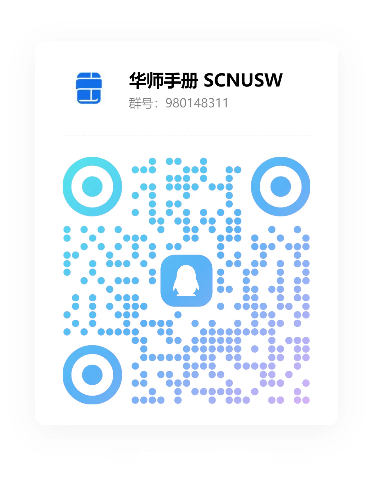

## 🎉 欢迎来到 **华师手册** 🎉

**华师手册（Online Manual for SCNUer）**

华师手册是一个专注于华南师范大学校园信息整合的平台，致力于为华师的师生提供全面、便捷的信息查询与服务。本项目由华师学生发起，欢迎所有华师人共同建设。

### 项目背景与初衷

本手册由华师汕尾校区的学生发起，内容主要集中在该校区。此外，我们的愿景是打破地域限制，覆盖整个华师校园。通过每一届华师学子的共同努力，我们希望华师手册能够成为一个开放共享、不断更新的知识与经验整合站点。

### 项目目标与愿景

我们的目标是打造一个为华师学子量身定做的实用指南，涵盖多个方面的信息，助力大家的学习与生活：

1. **学习成长规划**：提供详细的学术建议、选课指南、考试复习资源等，帮助同学们在学业上取得优异成绩。我们还会分享各类学习方法和时间管理技巧，帮助大家高效学习。
   
2. **校园生活服务**：涵盖宿舍生活指南、校园美食推荐、娱乐活动介绍等，丰富同学们的校园生活。我们会定期更新各类生活小贴士，帮助大家更好地适应大学生活。
   
3. **实习与就业**：分享实习机会、就业经验、职业规划建议，助力同学们在职业道路上取得成功。我们还会提供各类职场技能培训资源和求职面试技巧，帮助大家顺利踏上职业之路。
   
4. **社团与活动**：介绍各类社团及其活动，鼓励同学们积极参与课外活动，拓宽社交圈子，提升综合素质。我们会定期发布校园内外的各类活动信息，帮助大家找到兴趣所在。

### 我们的愿景

我们的愿景是让华师手册不仅成为信息的聚合地，更成为华师社区的纽带，促进信息交流与资源共享。我们相信，每一个华师人的参与和贡献，都是这个项目不断进步和完善的动力。无论你是刚入学的新生，还是即将毕业的学长学姐，甚至是已经踏入社会的校友，你的经验与建议都是我们宝贵的财富。

### 参与与贡献

我们欢迎每一位华师人加入到华师手册的建设中来。你可以通过提交信息、撰写经验分享、参与讨论等方式，为项目贡献自己的力量。我们将定期举办线上线下活动，邀请大家参与，共同探讨如何更好地服务于华师社区。

### 未来展望

展望未来，我们希望华师手册能够不断完善，通过全校师生的共同努力，华师手册将会成为一个充满智慧与经验的宝库，为每一位华师学子提供多方位的支持和帮助。

我们致力于将华师手册打造成一个动态更新的资源平台，持续收集和整合最新的信息和经验，确保内容的及时性和实用性。无论是新入学的同学，还是即将毕业的学子，甚至是已经走出校门的校友，都能从中找到自己所需的资讯和建议。

同时，我们也期待通过华师手册，促进华师社区的互动与交流。每一个人的经验和见解，都是宝贵的财富，值得分享和传承。我们相信，通过大家的积极参与和贡献，华师手册将会更加丰富多彩，真正成为华师学子心中的学习生活指南。

通过你我的共同参与，我们相信华师手册能够不断提升其质量和覆盖面，为每一位华师人提供更加优质的服务。华师手册，有你有我，共同书写华师学子的美好未来。

### 内容传播

华师手册地址是：https://scnusw.online

项目开源地址是：https://github.com/SCNU-SW/SCNU-SW-Online

华师手册 **[QQ交流群](https://qm.qq.com/q/9LZpNT7TGw)** ，可在群内反馈和沟通交流，群号：980148311

