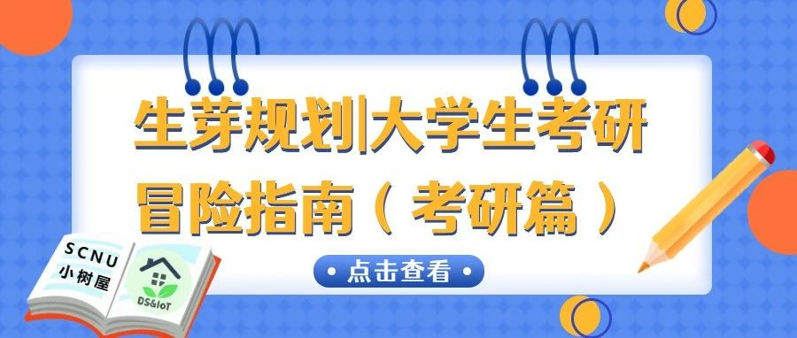
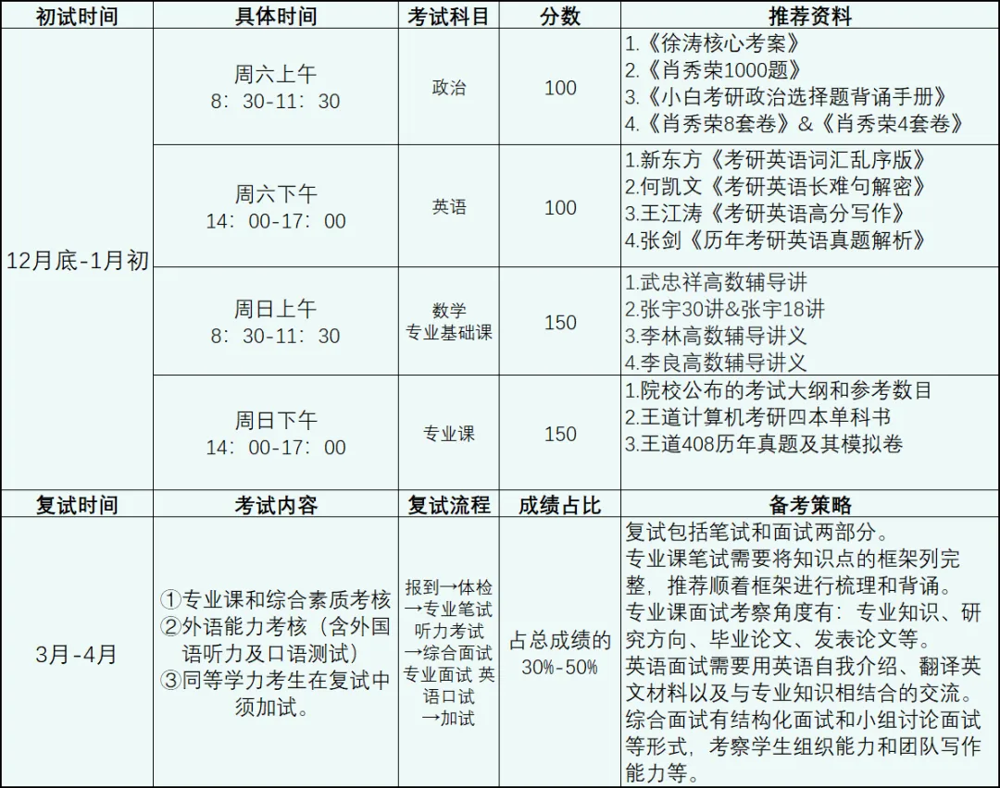
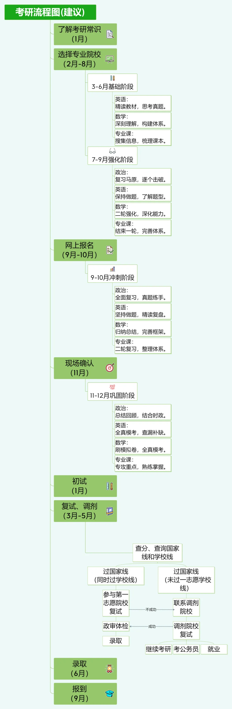
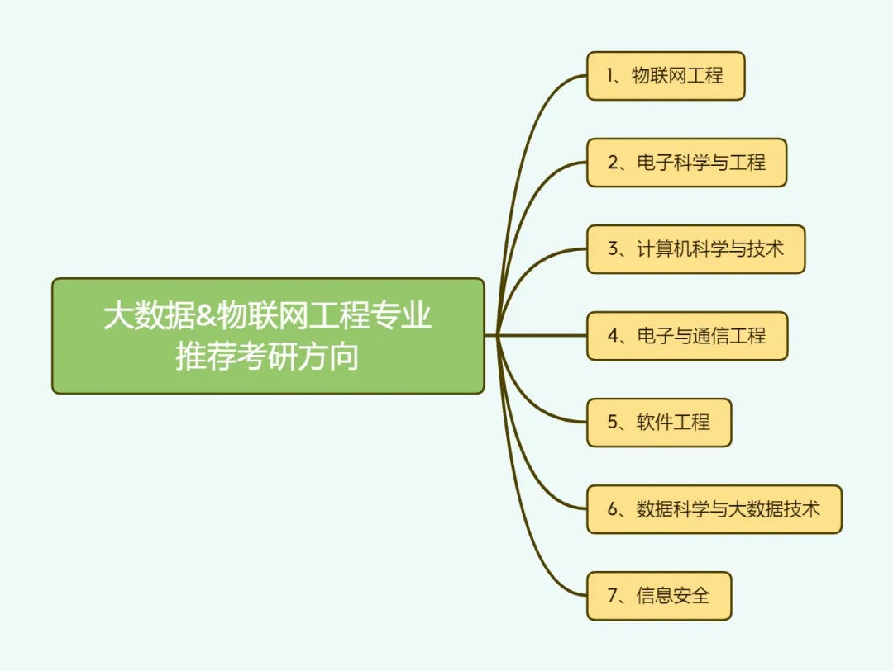
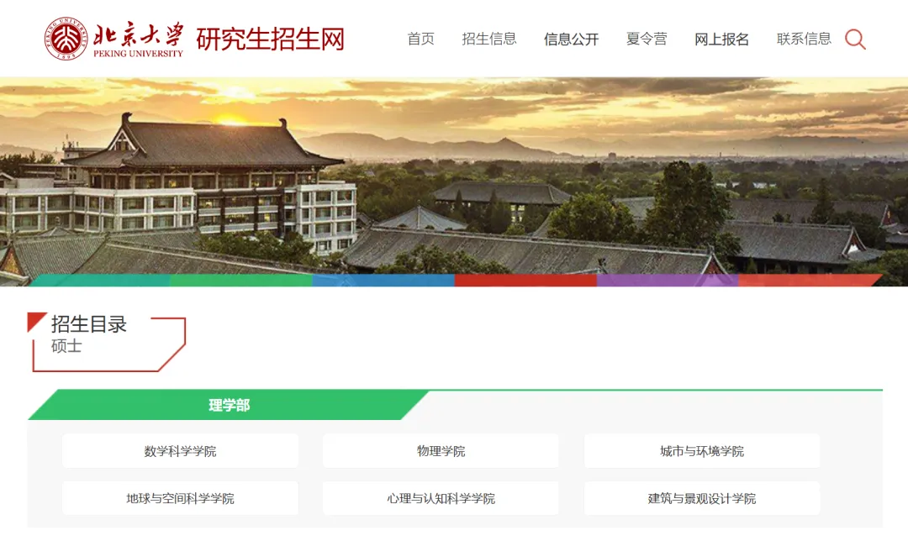
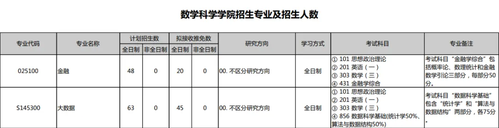

制定大学职业生涯规划的过程，是我们进行专业求知、职业探索的过程，更是一个探索自我、实现梦想的过程。而面对各种未来的选择，做好充分的准备，能让我们心中有数、遇事不慌，从而实现自我目标。

今天，小树屋将分享关于考研的相关信息，希望能够为数工院的小伙伴们提供小小的启发和帮助。

## PART 1: 考研流程简介

考研包括初试和复试两个阶段。具体的时间和细节我们整理成了下表供大家参考：

## PART 2: 考研规划以及备考建议

当我们面对详细的任务时， 会减少“摆烂”的程度；但是，当我们面对“没有规划，无从下手”的任务时，却往往会一拖再拖。因此制定规划，是我们克服焦虑，成为行动派的重要环节。

全年规划是为了让大家大概了解到这一整年的备考流程，具体到每个月的详细进度和复习建议，大家可以根据报考专业以及自身实际情况来制定。

考研规划因人而异，结合许多博主的建议，大体可以分为如下几个阶段：

## PART 3: 考研相关的院校和专业信息

由于不同学校的考试要求各不相同，意向考取不同院校的同学需要了解的专业信息会有较大的差别，因此首要了解的就是：院校信息、考研大纲、真题、教辅资料、知识点笔记、参考书目等等。

同学们可以参考下面的相关专业方向，进行考研方向的了解：

当确定好报考方向后，重中之重的是确定考试范围，有的放矢地复习。参考书目一般可以在学校官方的招生目录或者招生简章中找到，以北京大学大数据研究生为例：

（tips：招生简章一般涵盖了大数据专业的考试科目等信息，更加详细的信息可以搜集学长学姐们的上岸经验贴！）

希望通过小树屋的介绍，同学们能够对考研的各个方面有个大致的认识，并且为未来的备考做好充分的准备。

 

无论何时何地

让我们保持对知识的渴望和追求

请坚信

努力一定会有所回报

期待我们在考研的征程中成长和进步！

---

文案 | 于永豪 张君悠

排版 | 于永豪

初审 | 陈梓言 刘蕊

复审 | 何小雪 陈济禾

终审 | 林慧婷

---

来源 | 微信公众号：SCNU小树屋