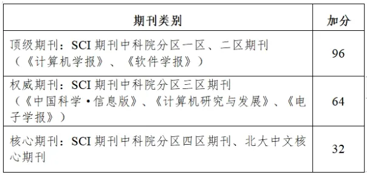

保研与考研是我们读研方向上两条成长路径，也是结合自身实际进行有针对性的努力而实现自我超越的选择。上期《树屋生芽·**考研篇**》为同学们介绍了计算机专业考研经验贴。
  
今天，《树屋生芽·==**保研篇**==》讲解属于数工人的“保研秘籍233”，以 ==**2个重要文件**、**3个专业积淀**、**3个时间节点，**== 为同学们明晰专业保研之路。
  
## 01 两个重要文件

### 文件1：学校保研总政策

[📎关于印发《华南师范大学推荐优秀应届本科毕业生免试攻读硕士学位研究生工作实施办法》的通知](./files/school_pgrec_policy.pdf)

详见华南师范大学学生手册·2023版 第160页

除学院的专业保研外，**学校保研总政策**中列出了各类专项计划推免遴选方案，包括**学术专长计划、学科提升计划、研究生支教团**等推免项目。
  
这也意味着在追求保研的道路上，同学们可以根据自身实际从多样的选择中找到适合自己的路径，选择最匹配的道路，充分发挥专业特长与自身优势。

### 文件2：学院专业保研政策

[📎数据科学与工程学院2024 年推荐优秀应届本科毕业生免试攻读硕士学位研究生工作实施细则](./files/school_pgrec_policy.pdf)

根据学院专业人才培养要求，**学院专业保研政策**详细说明了学院如何选拔和推荐优秀的应届本科毕业生免试攻读硕士学位的标准与要求，包含了**获取推免资格的资格条件、计分方法、遴选程序**等重要信息。

## 02 三个专业积淀

### 绩点

优异的绩点是**学习能力和专业实力**的直接反映，在保研、考研复试、留学申请等环节中，**绩点的高低很大程度影响我们的自信与竞争力**。因此，扎实掌握好专业知识，维持过硬绩点，当机遇来临时，我们才能以不变的底气，应万变的挑战。

具体计分方法详见《数据科学与工程学院 2024 年推荐优秀应届本科毕业生 免试攻读硕士学位研究生工作实施细则》

**学校的保研政策**中明确规定，学院专业保研选拔中，综合得分由**学业成绩（80%）和奖励加分（20%）**两部分构成，平均学分绩点在**3.0（含）以上**，且专业排名在同届同专业**前50%**。

**无挂科记录（含公共课）**是大多数院校的硬性指标，是保研的必然要求。因此，绩点几乎等同于保研的‘入场券’，稳住绩点，方能叩开保研的大门。

### 科研

科研是为保研筑梦、为未来赋能的征途

论文是思考深度的印记

课题探索是团队协作和集体智慧的提升平台

专利申请是创意由无到有的蜕变成果

走好科研的道路既是保研的坚实台阶

也是个人潜能与学术境界跃升的璀璨舞台

#### 科研之论文类

学院专业保研政策中，论文类作品的加分如下：

在国内外学术刊物上，以 **“华南师范大学数据科学与工程学院”为第一署名单位**，以收录期刊的等级，按照下表的标准计算分数。《细则》只承认**学生为第一作者或第一通讯作者**，若学术论文已录用但未正式发表，所计得分60%。

对于期刊类别的认定，可通过以下的工具查询：

- LetPub：最新SCI期刊影响因子查询及投稿分析系统
- Easyscholar：文献阅读及查阅期刊分区信息的插件

除此之外，在选刊发表阶段，可以参考华师代表性成果推荐目录进行选择：

[📎关于公布华南师范大学学科代表性成果推荐目录（试行）的通知（华师〔2022〕105号）](./files/achievements_catalog.pdf)

[📎关于印发华南师范大学科研业绩评价方案（2012年修订）的通知（华师〔2013〕73号）](./files/performance_evaluation.pdf)

#### 科研之课题类

课题立项包括：**一般课题、金种子项目、大学生创新创业项目、攀登计划**等。有意向申报的同学需多多关注校团委转发的各项通知，**积极参与课题项目，提升专业能力，为读研打好学术研究基础**。

学生作为负责人获得**国家级、省级、市级、校级**的科研项目立项，项目负责人分别计32分、24分、16分、8分；若项目获批为重点项目（如攀登计划省级重点项目），项目负责人所计得分200%；若项目结题评价为优秀，项目负责人增加6分；若项目已立项但未结题，所计得分60%；若项目中止，则该项目不计分。

#### 科研之专利类

**专利权人为“华南师范大学”**，学生为**独立发明人或者第一发明人**。相较于实用新型专利，发明专利的授权时间相对较长，因此在学院保研细则中，取得授权的发明专利和实用新型专利，每项分别计40分和10分。

如果专利已经受理，并进入实审且公开，但尚未授权，则所计得分30%。

### 竞赛

竞赛学生**署名单位为华南师范大学**，否则不纳入计分范围。对于团体赛项目（如全国大学生数学建模竞赛），每人均可按获奖等级计分；对于非团体赛项目，只有前4位成员（包括项目负责人学生在内）可按获奖等级计分，其余成员不计分。

在同一批次竞赛同一竞赛项目获得多级别奖励，只按最高奖计分，不重复计分；在同一批次竞赛多个竞赛项目获得奖励，每人限定最多2项计分。

获国家级特等、一、二、三等奖（或金银铜牌）者，分别计40分、32分、24分、18分；

获省级一、二、三等奖（或金银铜牌）者，分别计18分、12分、8分。

比赛介绍如下

上下滑动查看更多

## 03 三个时间节点

把握时间节点

每一步努力

都成为通往理想学府的坚实阶梯！

### 夏令营

**夏令营，是4-6月的学术盛夏，是优等生的同场竞技，更是提前锁定心仪院校的黄金时机。**即便开营时间可能与期末备考冲突，抉择虽难，但机遇更显珍贵。

在夏令营阶段，学校的高标准严要求伴随着丰富的录取名额，不少院校会在夏令营阶段完成大部分的招生计划。而脱颖而出的“**优秀营员**”，相当于拿到了录取的直通卡。

然而，**保研资格的公示时间点晚于夏令营的结营时间**，这意味着即便拿到优营，保研仍具有不确定性。但即便最终未能获取保研资格，**保研的汗水和优营的履历也能让你依旧闪耀，成为你的独特优势**。

### 预推免

**预推免时间一般为9月中旬至28日**，时间紧凑，竞争激烈。但预推免的流程相对简单，以高效的笔试和面试为主，部分院校有额外的英语考察。

相对夏令营的门槛更低，但录取比例只略低于夏令营，同学们需要把握好预推免的每一次考核。

### 九推

**“九推”，**全称为 **“九月正式推免”**，国家推免服务系统开始到结束这段时间，**时间是9月28日到10月25日；**是指经过网申、材料邮寄、初审、 复试等程序，学生正式获得研究生录取资格的机会。

"九推"的到来让保研迎来终章，这一阶段是零offer同学的最后希望，也是捡漏黄金期。因此，同学们需要密切关注剩余名额，参考历年的院校政策谨慎择校，并做好充足的面试准备。

虽然在每年的保研季，网络上都有大量的九推捡漏案例，但按照统计数据，其录取比例仍低于夏令营、预推免。因此，在夏令营与预推免的主动出击显得尤为关键。

**上述三个阶段的一些重要信息总结如下**

## 保研之旅，星辰大海的启航

在保研这条路上，你得到的不仅仅是一纸offer，更重要的是个人的成长与蜕变。愿每位保研路上的旅人，都能怀揣最初的梦想，以绩点为帆，科研为舵，经历夏令营的洗礼，预推免的冲刺，直至九推的最终抉择，怀揣满盈斗志，驶向梦校的彼岸。

最后，在小树屋的“生芽专题”保研篇的末尾，**祝愿所有有意向深造的同学，无论在哪片学术天空下，都能绽放最耀眼的光芒。**

---

文案 | 陈济禾 罗杰豪

排版 | 陈济禾 罗杰豪

初审 | 陈梓言 刘蕊

复审 | 何小雪

终审 | 林慧婷

---

来源 | 微信公众号：SCNU小树屋