## 第一章 概论
https://blog.csdn.net/qq_74140313/article/details/140131680
### 选择题
1. 1949年，（）发表了题为《保密系统的通信理论》的论文，该论文为密码系统建立了理论基础，从此密码学成为了一门科学 ==A. Shannon== B. Diffle C. Hellman D. Shamir
2. 截取是针对信息（）的攻击 ==A. 机密性== B. 完整性 C. 认证性 D. 不可否认性
3. 篡改是针对信息（）的攻击 A. 机密性 ==B. 完整性== C. 认证性 D. 不可否认性
4. 伪造是针对信息（）的攻击 A. 机密性 B. 完整性 ==C. 认证性== D. 不可否认性
5. 抵赖是针对信息（）的攻击 A. 机密性 B. 完整性 C. 认证性 ==D. 不可否认性==
6. 在公钥密码思想提出一年后的1978年，Rivest、（）和Adleman提出了RSA算法，这是迄今为止第一个实用的、应用最广的公钥密码算法 A. Shannon B. Diffle C. Hellman ==D. Shamir== （RSA对应姓名首字母）
7. 2019年10月26日下午，十三届全国人大常委会第十四次会议表决通过了《中华人民共和国密码法》，于（）正式施行 A. 2019年11月1日 B. 2019年12月1日 ==C. 2020年1月1日== D. 2020年2月1日
### 填空题
1. 密码学的**主要目标**是值：==机密性==、==完整性==、==认证性==、==不可否认性==。
2. 经典的**信息安全三要素**：==机密性==、==完整性==、==可用性==，是信息安全的核心原则
3. 根据对信息流造成的影响，**攻击有五种形式**：==中断==、==截取==、==篡改==、==伪造== 和 ==重放==，进一步可以概括为两类：==主动攻击== 和 ==被动攻击==。
4. 1949年，香农Shannon发表了 ==《保密系统的通信理论》== 论文，为密码系统建立了理论基础，从此密码学成为一门科学
5. 密码学的发展大致经历了两个阶段：==传统密码==、==现代密码==。
6. 1976年，Diffle和Hellman在 ==《密码学的新方向》== 一文中提出了公钥密码体制的思想，从而开创了现代密码学的新领域
7. ==密码法规== 是社会信息化密码管理的依据
### 名词解释
1. **机密性**：又称保密性，是指信息在 ==其生命周期内== 不泄露给 ==非授权的实体或用户==
2. **完整性**：数据在 ==其生命周期内== 维持 ==准确性== 和 ==一致性==
3. **认证性**：信息的来源或者信息本身能 ==被正确地标识==，同时确保该标识 ==没有被伪造==
4. **不可否认性**：用户不能在 ==事后否认== 曾经进行过的 ==信息的生成、签发、接受== 等行为
5. 标准化：为了在一定范围内获得最佳秩序，对现实问题或潜在问题指定共同使用和重复使用的条款的活动，==即指定、发布及实施标准的过程==
6. 《密码法》：我国密码领域第一部综合性、基础性法律
### 简答题
1. 密码的主要功能有哪些？这些功能的实现分别与哪种密码技术密切相关？
	(1)密码的主要功能：机密性、完整性、认证性、不可否认性。(2)分别与加密技术，哈希函数，消息认证技术和身份认证技术，数字签名技术相关
2. 简述密码学和信息安全的关系
	- 密码学是与信息安全多方面**有关的数学技术**的研究
	- 密码学是保障**信息安全**的**核心技术**，但不是提供信息安全的唯一方式
	- 信息安全是密码学研究与发展的**目的**
	- 信息安全的**理论基础**是密码学，信息安全的**问题根本解决**通常依靠密码学理论
3. 密码学的发展大致阶段
	传统密码和现代密码，其中传统密码又分为两个阶段：古代密码和近代密码
## 第二章 密码学基础
### 选择题
1. 一个密码系统至少由明文、密文、加密算法、解密算法、密钥5个部分（五元组）组成，而其安全性是由（==密钥==）决定的
2. 密码分析者通过各种手段掌握了相当数量的明-密文对可供使用，这种密码分析是（==已知明文攻击==）
3. 在现代密码学技术中，（==哈希函数==）技术与密钥无关
4. 算法的计算复杂度是由他所需要的时间和空间量级来度量的，算法运行时间量级最高的是（）A. $O(1)$ B. $O(n)$ C. $O(n^{10})$ ==D.== $O(2^{n})$
5. 计算出或估计出破译一个密码系统的计算量下限，如果利用已有的最好办法破译他所需要的代价超出了破译者的破译能力，那么该密码系统的安全性是（==计算上的安全==）
### 填空题
1. 密码学是研究信息及信息系统安全的科学，密码学又分为 ==密码编码学== 和 ==密码分析学==
2. 从安全目标看，密码编码学主要分为 ==保密体制== 和 ==认证体制==
3. 密码体制是指**实现加密和解密功能的密码方案**，从使用密钥策略上，可分为 ==对称密码体制== 和 ==公钥密码体制==
4. 对称密码体制又称为 ==单密钥== 密码体制，它包括 ==分组密码== 和 ==序列密码==
5. 在认证通信系统模型中，目前广泛使用的基于**对称认证体制**的技术主要是 ==消息验证码==，**非对称的消息认证技术**的代表为 ==数字签名==
### 名词解释
1. 密码编码学：研究 ==如何对信息编码== 以实现 ==信息和通信安全== 的科学
2. 密码分析学：研究如何 ==破译或攻击== 受保护信息的科学
3. **柯克霍夫原则**：系统的保密性 ==不依赖于对加密体制或算法== 的保密，而 ==依赖于密钥==
	1. 一个密码体制中的**五元组除密钥**全公开
	2. 仅保密密钥
	3. 攻击密码体制的主要出发点：==寻找密钥==
4. 唯密文攻击：1.加密算法 2.截获的部分密文
5. **已知明文攻击**：1.加密算法 2.截获的部分密文和相应的明文
6. 选择明文攻击：1.加密算法 2. ==加密== 黑盒子，可加密任意明文得到相应的密文
7. 选择密文攻击：1.加密算法 2. ==解密== 黑盒子，可解密任意密文得到相应的明文
### 简答题
1. 公钥密码体制与对称密码体制相比有哪些优点和不足？
	- 对称密码体制优点：
		1. ==运算速度== 快；
		2. 对称密码体制中使用的 ==密钥相对较短==；
		3. 对称保密体制的 ==密文长度== 往往与明文长度相同
	- 对称密码体制缺点：
		1. ==密钥分发难==，往往需要付出较高代价
		2. ==密钥量大==，难以管理
		3. 难以解决 ==不可否认性== 问题
2. 简述密码算法公开的意义
	1. 有利于增强密码算法的 ==安全性==：能接受大众检验
	2. 有利于密码技术的 ==推广应用和标准化==：使用相同密码算法的人才能方便有效地实现保密通信
	3. 有利于增加用户 ==使用信心==：即使密码算法设计者没有密钥也不能有效解密
	4. 有利于 ==密码技术的发展==
## 第三章 传统密码体制
### 基本知识
古典密码技术：
1. 移位密码
	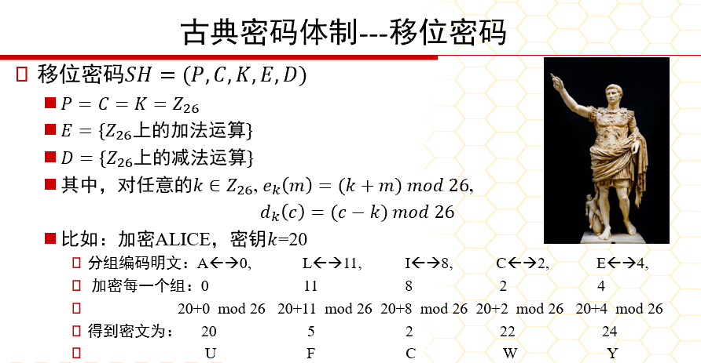
	1. 密钥空间K=26
	2. 使用枚举攻击
2. 代换密码
	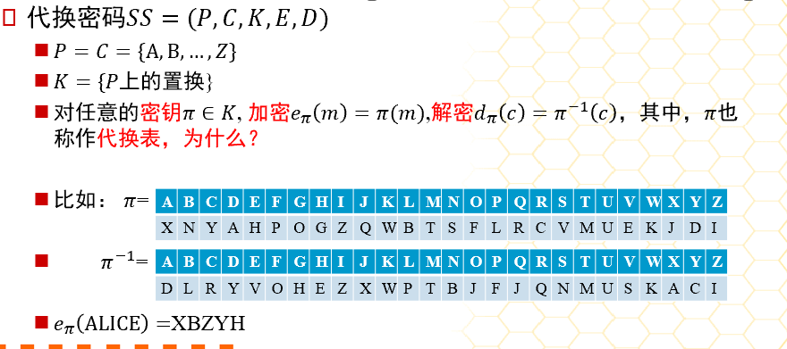
	1. K={P上的置换}
	2. 使用统计分析：自然语言统计（没有破坏明文的统计规律）
	3. **移位密码**和**仿射密码**是代换密码的特殊情况（均为**单表代换密码**）
	4. 特点：明文字母被密文字母代替，都有一个代替法则
	5. 缺点：没有破坏明文的统计规律，同一个字母被加密成相同的密文。
3. 仿射密码
	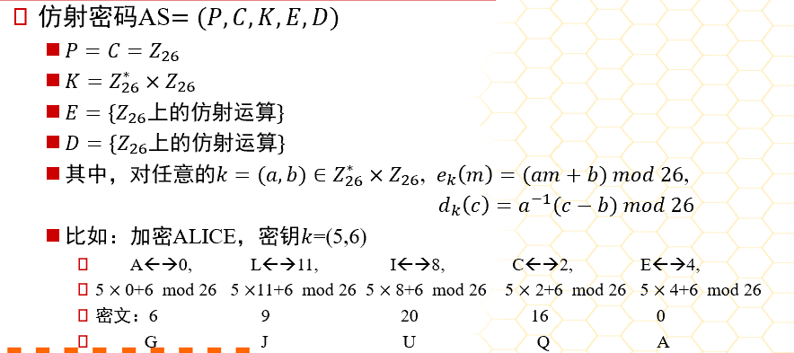
	1. $e_k(m)=(am+b)mod26$；$d_k(c)=a^{-1}（c-b)mod26$
	2. K=12\*26=312：a必须满足gcd（a，26）=1，即a与26互质。因为 a 需要存在模 26 的乘法逆元$a^{-1}$来解密，因此只有12个数（1,3,5,7,9,11,15,17,19,21,23,25）满足条件
4. 维吉尼亚密码
	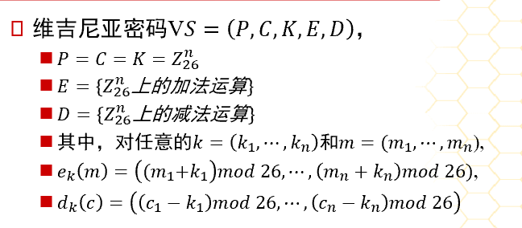
	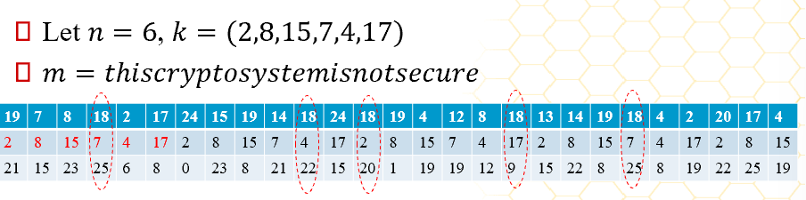
	1. K=$26^{n}$
	2. 一定程度破坏了明文的统计特性，但仍然抵抗不了统计分析
5. 希尔密码
	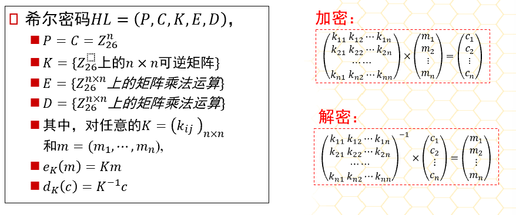
6. 置换密码
	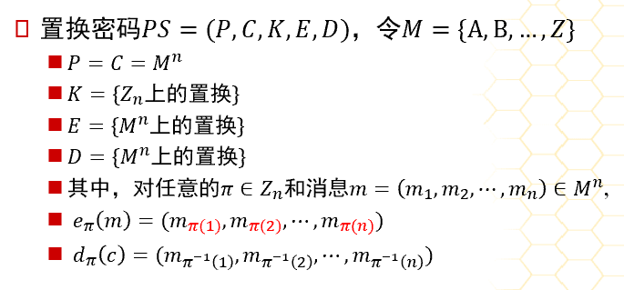
	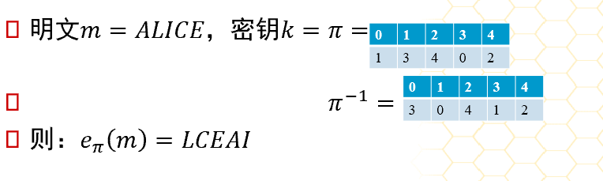
	1. 置换密码可以理解为希尔密码的特例
7. 乘积密码
	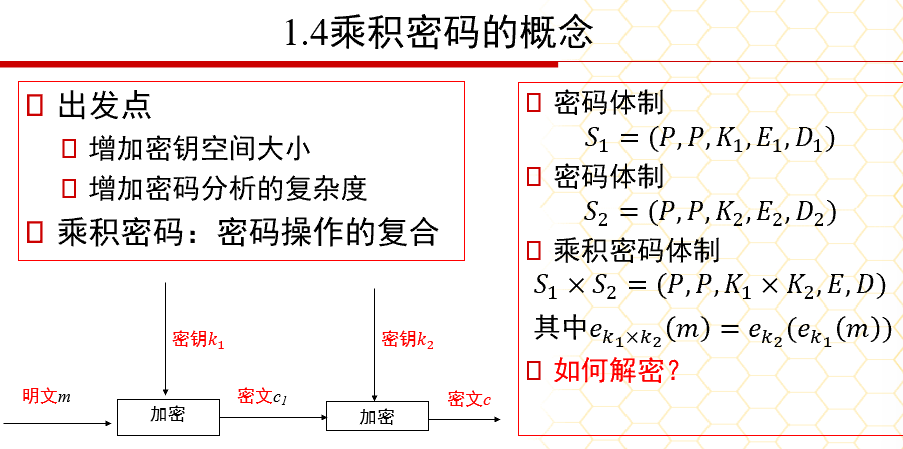
	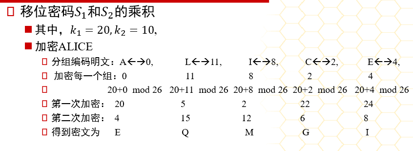
	1. 乘积密码：密码操作的复合，因此不改变密码体制（保持复杂性不变）
	2. 出发点
		1. 增加密钥空间大小
		2. 增加密码分析的复杂度
	3. 一个密码体制是**幂等**的，如果他们的乘积保持不变
### 选择题
1. 字母频率分析法对哪种密码算法最有效（==单表代换密码==）
2. 那种密码算法抵抗频率分析攻击的能力最强，而抵抗已知明文攻击的能力最弱（==希尔密码==）
3. Enigma密码机哪个部件实现了**多表代换**（==轮子==）
4. Enigma密码机哪个部件实现了**单表代换**（==接线板==）
5. **维吉尼亚密码**是古典密码体制中比较有代表性的一种密码，其密码体制采用的是（==多表代换密码==）
6. 希尔密码能较好地抵抗统计分析法，对抗（==唯密文攻击==）的安全强度较高，但易收到其他攻击（1.已知明文攻击；2.选择明文攻击；3.选择密文攻击）
### 填空题
1. **仿射密码**的加密算法其实是一个线性变换，仿射加密的密钥空间K大小为 ==312==\=26\*12
2. 在英文文档中，字母出现概率不同，通常字母 ==e== 出现概率最高，概率约为 ==0.127==
### 名词解释
1. **置换密码**：根据一定的规则重新排序明文，以便打破明文的结构特性
2. **代换密码**：将明文中的字符替换成其他字符的密码体制
3. **多表代换密码**：以**一系列代换表**依次对明文信息的**字母序列**进行代换的加密方法，即 ==明文信息中出现的同一个字母在加密时不是完全被同一个固定的字母代换，而是根据其出现的位置次序用不同的字母代换==
### 简答题
1. 求置换$\sigma=\begin{pmatrix}1 & 2 &3 &4&5&6&7&8 \\5 & 1&7&2&6&8&4&3\end{pmatrix}$的逆置换
	$\sigma^{-1}=\begin{pmatrix}1 & 2 &3 &4&5&6&7&8 \\5 & 1&7&2&6&8&4&3\end{pmatrix}^{-1}$=$\begin{pmatrix}1 & 2 &3 &4&5&6&7&8 \\2 & 4&8&7&1&5&3&6\end{pmatrix}$=$\begin{pmatrix}1 & 2&4&7&3&8&6&5\end{pmatrix}$
	解释：1->2->4->7->3->8->6->5
2. 用维吉尼亚密码加密明文“*please keep this message in secret*”，其中使用的密钥为“*computer*”，试求其密文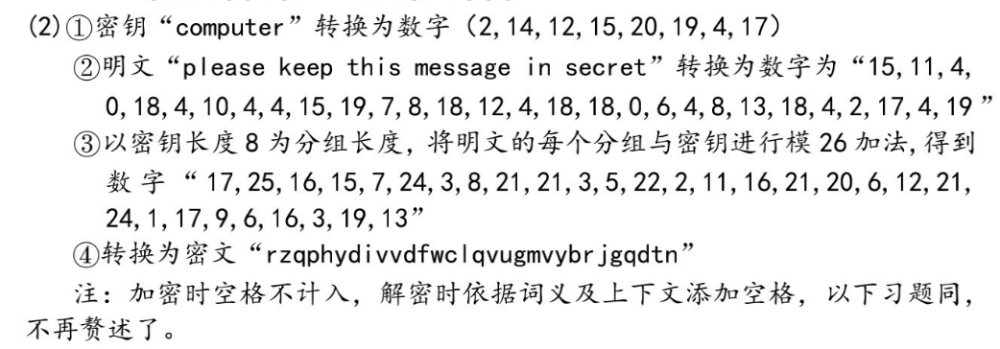 ==此答案计算过程有误，参考下面计算（但是下面的k密钥以a=1来计算了，应该是a=0，b=1这样来计算，我真的懒得写了）== 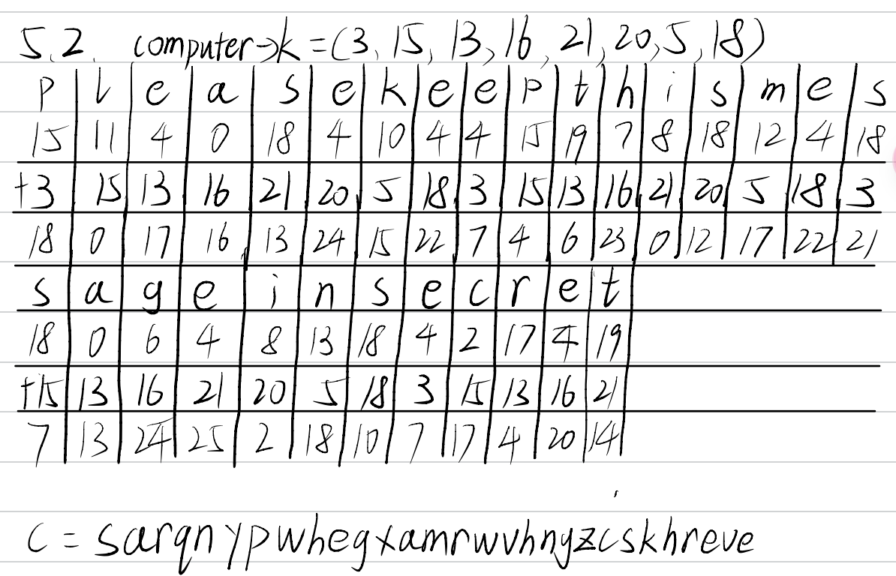
3. 已知以下密文是仿射密码得到的，试求明文。FMXVEDKAPHFERBNDERXRSREFMORUDSDKDVSHVUFEDKAPRKDLYEVLRHHRH
	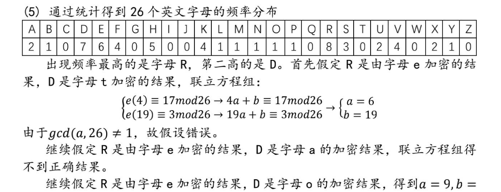
	1. 将两个方程相减，消去 b：$(19a+b)−(4a+b)≡3−17mod  26(19a+b)−(4a+b)≡3−17mod26$
	2. 化简：$15a≡12mod  26$
	3. 乘法逆元$15^{-1}=7$：
		$15*15^{−1}≡1mod26$
		$15⋅7=105≡1mod26$
    4. $15a≡12mod26$ 两边乘以 $15^{-1}$：
	    $a≡12⋅7mod26 ->a≡84mod26 ->a≡6mod26$ 
	    同理可得$b≡−7mod26$
	    解得$a=6,b=19$
	**PS：** 逆元计算：暴力枚举法（够用了）
```python
		#记x*x^-1=1mod(n),设x^-1=y
		y=1
		while (x*y)%n!=1：
			y+=1 
```

1. P67简答题（6）已知维吉尼亚密码加密密文求明文（==我觉得不考这么难的==）
## 第四章 分组密码
### 选择题
1. （==1977==）年，NBS把IBM的Tuchman-Meyer方案确定为数据加密标准，即DES
2. 在现代密码学发展史上，第一个广泛应用于商业数据保密的密码算法是（==DES==）
3. 1977年，由NBS批准的联邦数据加密标准DES的**分组长度**是（==64位==）
4. 在现有的计算能力条件下，对于**对称密码算法**，被认为安全的**密钥最小长度**是（==128位==）
5. 分组密码算法主要解决信息安全存在的（==保密性==）问题
6. 在分组密码算法中，如果分组长度过短，那么攻击者可利用（**==选择**明文攻击==）来破解
7. 在DES算法中，如果给定初始密钥k，经子密钥产生器产生的各个子密钥都相同，则称该密钥k为弱密钥，**DES算法弱密钥**的个数为（==4==）
8. **差分分析**针对哪种密码算法的分析更有效果（==DES==）
9. AES由4个不同的模块组成，其中（==字节代换==）是非线性模块
	AES：字节代换->行移位->列混合->密钥加->字节代换->...->...
	DES：拓展置换（E表）->子密钥异或（XOR）->替换（S盒：混淆）->置换（P：扩散）->左右交换->拓展置换->...
10. 适合文件加密，而且有**少量错误时不会造成同步失败**，是软件加密的最好选择，这种分组密码的操作模式是指（==密码分组链接模式（CBC）==）
11. 目前在针对DES的攻击算法中，除了穷举攻击以外，差分分析和线性分析是两个最有力的分析方法。其中，**差分分析**是一种基于（==选择明文攻击==）的方法，**线性分析**是一种基于（==已知明文攻击==）的方法
12. 下面的分组密码工作模式中哪个更适合用于针对**伪随机数的加解密**？ ==A.电子密码本模式（ECB）== B.密码分组链接模式（CBC） C. 密码反馈模式（CFB） D.计数器模式（CTR）
13. 下面的分组密码工作模式中哪个能够**随机访问或处理某密文分组**？==计数器模式（CTR）==
14. 下面的分组密码工作模式中哪个更适合用于**传输信息线路差**的场合？==输出反馈模式==
15. 分组密码的加、解密算法中最关键的部分是**非线性运算**部分，那么**DES加密算法**的非线性运算部分是指 ==S盒==，**AES加密算法**的非线性运算部分是 ==字节代换==
16. 在AES中，**分组长度**只能是 ==128位==，**密钥长度**可以是 ==128位==、==192位==、==256位== 中的任意一种
### 简答题
1. 为什么二重DES不像人们想象那样可将密钥长度提高到112比特，而是相当于57比特？简要说明原因。
	对于二重DES，可以使用中途相遇攻击，此时计算量级($2^{56}$)与攻击DES的计算复杂度($2^{55}$)相当，即二重DES密钥的复杂度与单DES密钥基本在同一数量级。
	中途相遇攻击：**首先**，将P按所有可能的密钥$K_1$加密，将得到的加密结果排序并放置在表T内；**然后**，将C用所有可能的密钥$K_2$解密，每解密一次就将解密结果与T中的值相比较；**若**相等，就用测试的两个密钥对P加密，**若**结果为C，则认定这两个密钥就是正确的密钥$K_1和K_2$
2. 简述三重DES的优点和不足。
	- 优点：
		1. 密钥长度K增加到**112位或168位**，可以有效抵抗DES面临的穷举攻击
		2. 相对于DES，增强了**抗差分分析**和**抗线性分析**的能力
		3. 三重DES对**密码分析攻击**有很强的免疫力
	- 不足：
		1. 三重DES的**处理速度较慢**，尤其是基于软件实现时
		2. 虽然密钥长度增加了，但是**明文分组的长度**没有变化，仍为**64位**，对于效率和安全性而言，与密钥长度的增加不相匹配。
3. 简述DES和AES的相同和不同之处
	- 相同：
		1. 二者的**轮函数**都是由3层构成的：**非线性层**、**线性混合层**、**子密钥异或**（XOR），只是顺序不同。
		2. AES的**子密钥加**对应于DES中 ==S盒前== 的**子密钥异或**。
		3. AES的**列混合运算**的目的是让不同字节相互影响，而DES中**F函数**的输出（==右半部分经过F函数处理==）与左边一半数据相加也有类似的效果
		4. AES的**非线性运算**是**字节代换**，对应于DES中唯一的非线性运算**S盒**
		5. AES**行移位运算**保证每一行的字节不仅仅影响其他行对应的字节，而且影响其他行所有的字节，与DES的**P**相似
	- 不同：
		1. AES的**密钥长度**（128位、192位、256位）可变，而DES的密钥长度固定为56位
		2. DES是面向**比特的计算**，AES是面向**字节的计算**
		3. AES的**加密运算和解密运算**不一样，因此加密器不能同时用作解密器，DES没有这个限制

|  AES  |       DES       | 作用                             |
| :---: | :-------------: | :----------------------------- |
| 子密钥加  |      子密钥异或      |                                |
| 字节代换  |       S盒        | 非线性运算                          |
| 行移位运算 |        P        | 保证每一行字节不仅影响其他行对应的字节，更影响其他行所有字节 |
| 列混合运算 | F函数的输出与左边一般数据相加 | 让不同字节相互影响                      |


1. 总结ECB模式、CBC模式、CTR模式的优缺点。
	- ECB模式：
		- 优点：简单快速，**加解密**都支持**并行计算**
		- 缺点：
			1. 明文中的**重复排列**会反映在密文中
			2. 通过**删除、替换密文分组**可以对明文进行攻击
			3. 对包含某些**比特错误的密文**进行解密时，**对应分组**会出错
			4. 不能抵御**重放攻击**
	- CBC模式：
		- 优点：
			1. 明文中的**重复排列**不会反映在密文中
			2. **解密**支持**并行计算**，能够解密**任意密文分组**
		- 缺点：
			1. 对包含某些**比特错误**的密文组解密时，**该分组和后续分组**会出错
			2. **加密**不支持**并行计算**
	- CTR模式：
		- 优点：
			1. 不需要**填充**
			2. 可**预先进行加解密的准备**，使得加解密就是**异或**的操作
			3. 对包含某些比特错误的密文进行解密时，只有**明文中相对应的比特**会出错
			4. 加解密都支持并行计算
		- 缺点：
			1. 主动攻击者**反转密文分组中的某些比特**时，**明文分组中相对应的比特**也会反转

|        | ECB                                                                                                                  | CBC                                                                 | CTR                                                                                                                 |
| :----: | :------------------------------------------------------------------------------------------------------------------- | :------------------------------------------------------------------ | :------------------------------------------------------------------------------------------------------------------ |
| ==优点== | 简单快速，**加解密**都支持**并行计算**                                                                                              | 1. 明文中的**重复排列**不会反映在密文中<br>2. **解密**支持**并行计算**，能够解密**任意密文分组**       | 1. 不需要**填充**<br>2. 可**预先进行加解密的准备**，使得加解密就是**异或**的操作<br>3. 对包含某些比特错误的密文进行解密时，只有明文中 ==**相对应的比特**== 会出错<br>4. 加解密都支持并行计算 |
| ==缺点== | 1. 明文中的**重复排列**会反映在密文中<br>2. 通过**删除、替换密文分组**可以对明文进行攻击<br>3. 对包含某些**比特错误**的密文进行解密时，==**对应分组**== 会出错<br>4. 不能抵御**重放攻击** | 1. 对包含某些**比特错误**的密文组解密时，==**该分组和后续分组**== 会出错<br>2. **加密**不支持**并行计算** | 主动攻击者**反转密文分组中的某些比特**时，明文分组中 ==**相对应的比特**== 也会反转                                                                      |

## 第五章 序列密码
### 概念
- 流密码（又称序列密码）：明文信息按**比特逐比特地加密**的一类密码算法
	- 加密：$c=m \oplus k$
	- 解密：$m=c \oplus k$
		($\oplus为异或操作！$)
	- 可以根据明文和密文计算出密钥：
		$k=m \oplus c$
- 一次一密（Vernam）：密钥序列$k_i$能够被独立地随机生成
	- 优点：
		1. 算法简单易懂
		2. 加密、解密速度快
	- 缺点：
		1. 密钥太长，和消息一样长
		2. 一个密钥只能用一次
- 序列密码的设计关键在于 ==密钥序列产生器==
- 一般来说，一个反馈移位寄存器由两部分组成：==移位寄存器== 和 ==反馈函数==
### 习题
1. 序列密码属于 ==对称密码体制==，又称为 ==流密码==。
2. 序列密码的设计关键在于 ==密钥序列生成器==。
3. 序列密码的工作方式一般分为 ==同步序列生成器== 和 ==自同步序列生成器==。
4. 一般的，一个反馈移位寄存器由两部分组成：==移位寄存器== 和 ==反馈函数==。
5. 简述序列密码算法（与分组密码算法相比）的特点
	1. 安全强度取决于密钥序列的**不可预测性**，加解密简单
	2. 在某些情况（如数据通信）下，譬如**缓冲不足或必须对收到字符进行及时处理**时，序列密码就很有优势
	3. 在软硬件实现上，不需要高性能平台或复杂的硬件电路，**加解密速度快**
## 第六章 哈希函数和信息认证
### 选择题
1. 下面哪个不是Hash函数的等价提法（）==A.压缩信息函数== B.哈希函数 C.散列函数 D.杂凑函数
2. 下面哪个不是Hash函数具有的特性（）A.单向性 ==B.可逆性== C.压缩性 D.抗碰撞性
3. 现代密码学中很多应用都包含散列运算，而下面的应用中不包含散列运算的是（）A.信息机密性 B.信息完整性 C.消息认证码 D.数字签名
4. 散列（哈希）技术主要解决信息安全存在的（）问题 A.保密性 ==B.完整性== C.可用性 D.不可否认性
5. 在众多哈希算法中，SHA被称为安全的哈希函数，其中SHA256/224生成信息的哈希值长度是（）A.128位 ==B.224位== C.256位 D.512位
6. 下面哪一项不是哈希函数的应用（）A.文件校检 B.数字签名 ==C.数据加密== D.安全存储口令
7. SHA256是以（==512==）位分组来处理输入信息的
8. SHA256算法可接受输入消息的最大长度是 ==（$2^{64}-1$）比特==
9. 分组加密算法（如AES）与散列函数算法（如SHA)的实现过程的最大不同是（==可逆==）
10. 生日攻击是针对（==SHA==）密码算法的分析方法
11. 设哈希函数的输出长度为n比特，则安全的哈希函数寻找碰撞的复杂度应该为 ==（$O(n^{n/2})$）==
12. SM3算法是国家密码管理局发布的一种密码散列函数标准，生成消息的哈希值长度是（==256位==）
13. 下面的分组密码工作模式中哪一种能生成信息认证码（==密码分组链接模式==）
14. 消息认证码（MAC）的主要作用是实现（==消息的完整性==）和明确消息的来源
### 简答
1. 简要说明哈希函数的特点
	1. 哈希函数主要用于**消息认证**和**数字签名**（h=H(M)）
	2. 哈希函数H( )可用于 =="任意"长度== 的消息
	3. H产生**定长的消息**
	4. 对任意给定的信息x，计算H(x)比较容易，用**硬件和软件均可实现**
	5. **单向性**：对给定的散列值h，找到满足H(x)=h的消息x在计算上是不可行的
	6. **抗碰撞性**：
		1. 抗弱碰撞性：对给定的消息x，找到满足$y\neq x$且H(x)=H(y)在计算上是不可行的（给定 x, 找到 $y\neq x$ 使得 H(x)=H(y)）
		2. 抗强碰撞性：找到任何满足H(x)=H(y)的偶对(x,y)在计算上是不可行的（选择x,y，找到任意$y\neq{x}$使得 H(x)=H(y)）
2. 在一个广域网的应用环境中，用户使用用户名和口令的模式登录远程服务器，服务器的管理院给每个用户设置一个初始口令，请用哈希函数实现以下安全需求：（1）用户口令相关信息在广域网上安全传输（也就是说，即使攻击者窃取了用户网上传输的信息，也分析不出口令）；（2）管理员也不知道用户的口令
	1. 新口令设置：**首先**，将用户的新口令用哈希函数生成哈希值1；**然后**，将旧口令用哈希函数生成哈希值2；**之后**，使用哈希值2作为密钥加密哈希值1生成密文。**最后**，认证系统使用数据库中的哈希值2作为密钥解密得到哈希值1，用哈希值1替换数据库中的哈希值2。
	2. 远程口令认证：**首先**，认证系统生成随机数nonce发给用户，用户的口令**先**使用哈希函数得到哈希值后，**再**与随机数结合，**最后**通过哈希函数生成应答1；**然后**，认证系统将数据库中的口令哈希值与随机数结合，用哈希函数生成应答2，**再**将应答1与应答2匹配判断是否通过。
	3. 分析：
		1. 在**远程认证过程**中，攻击者能截取到应答1，但由于哈希函数的单向性，攻击者即使得到随机数也无法分析出口令的哈希值以及口令。每次认证使用不同的随机数能防止攻击者的重放攻击。因此可以在广域网上安全传输
		2. 在**设置新口令过程**中，攻击者能截取到密文，但由于不知道初始口令，无法得到密钥，从而攻击者不能破解得到新口令的哈希值；**同时**根据哈希函数的单向性，管理员也无法得到新口令
		3. 新口令设置：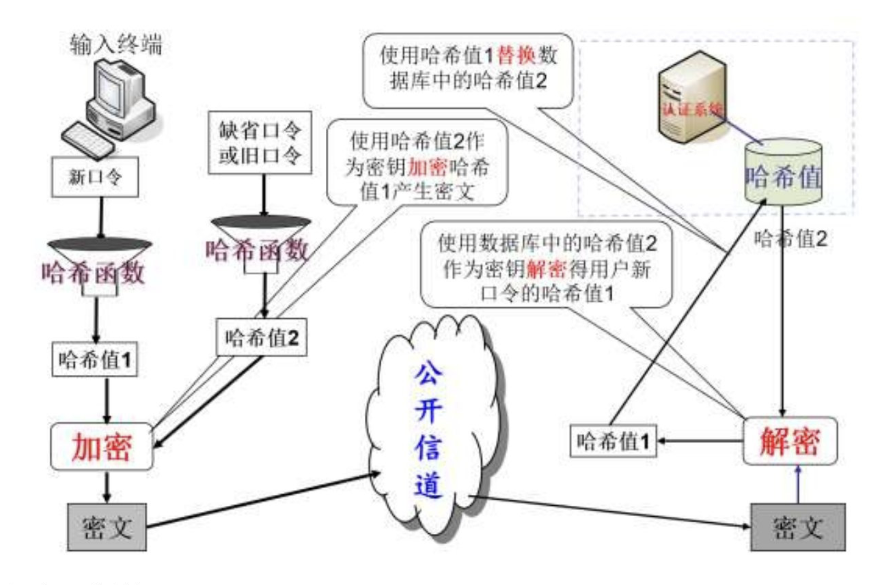
		4. 远程口令认证：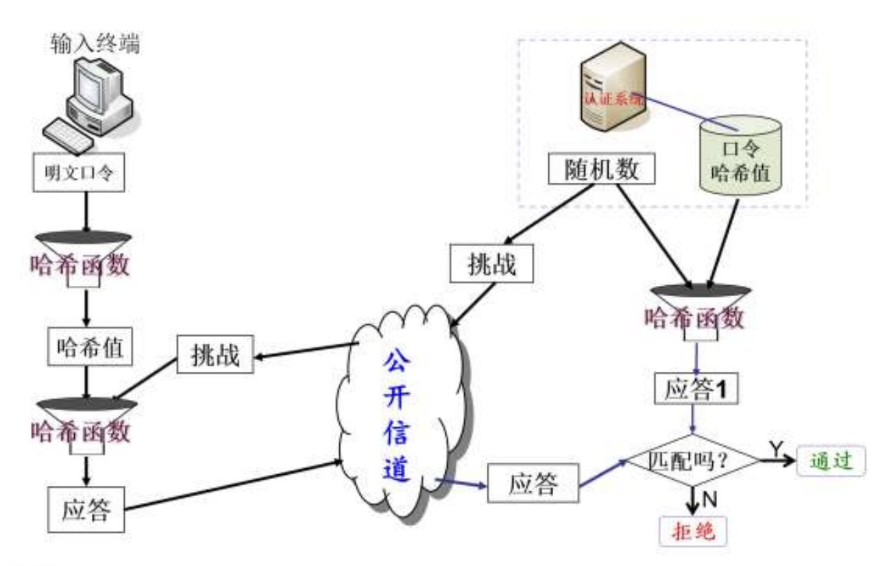
## 第七章 公钥密码体制
### 选择题
1. 公钥密码体制解决了对称密码体制的密钥分发问题，那么在公钥密码算法中，加密对称密钥所使用的密钥是（==接收方的公钥==）
2. 第一个较完善、目前使用最多的公钥密码算法是（==RSA公钥密码算法==）
3. 在RSA公钥密码算法中，针对参数p和q的选择，下面哪个说法是不正确的（）==A.p和q的长度相差很大== B.p和q的大小相差很大 C.p和q都应为素数 D.p-1和q-1都应有大的素数因子
4. 在现有的计算能力条件下，非对称密码算法RSA被认为安全的最小密钥长度是（==2048位==）
5. 设在RSA公钥密码体制中，公钥为（e,n）=（3，55），则私钥d=（==27==）
	n=$p\times q$, $\phi(n)=(p-1)(q-1)=(5-1)(11-1)=40$
	$gcd(e,\phi(n))=gcd(3,40)=1，满足条件$$(要求gcd(e,\phi(n))=1)$
	$e×d≡1(modϕ(n))即3×d≡1(mod40)$得到d=27
6. 二次筛因子分解法是针对下面哪种密码算法的分析方法（==RSA公钥密码算法==）
7. 小步大步法是针对下面哪种密码算法的分析方法（==ElGamal公钥密码算法==）
8. 指数积分法是针对下面哪种密码算法的分析方法（==ElGamal公钥密码算法==）
9. 下面哪种公钥密码算法针对同一密文可能有多个明文（==Rabin公钥密码算法==）
10. 下面哪种公钥密码算法适用于单个二进制加解密，加密后数据拓展最多（==Goldwasser-Micali概率公钥密码算法==）
11. 下面哪种公钥密码算法能根据公钥识别用户的身份（==SM9算法==）
12. 下面哪种公钥密码算法属于后量子密码（==NTRU算法==）
13. SM2算法是国家密码管理局发布的一种非对称密码算法标准，其安全性是基于下面哪个困难问题的（==基于椭圆曲线的离散对数问题==）
14. NTRU算法的安全性是基于格的困难问题的，这个难题是指（==寻求非零的最短向量问题==）
### 简答题
1. 公钥密码体制与对称密码体制相比有哪些优点和不足
	- 公钥密码体制优点：
		1. 密钥分发简单
		2. 需秘密保存的密钥量减少
		3. 可以实现数字签名和认证的功能
	- 公钥密码体制不足：
		1. 公钥密码算法比对称密码算法慢
		2. 密钥长度长
		3. 有数据拓展
2. 针对RSA公钥密码算法，设p=11，q=17，取e=7作为公钥，求私钥。假如明文m=222，得到的密文c是多少？对密文c进行解密，最后恢复出明文m。
	- 求私钥d
		1. $n=p*q=187$, $\phi(n)=(p-1)(q-1)=160$
		2. $gcd(e,\phi(n))=gcd(7,160)=1$满足条件
		3. e×d≡1(modϕ(n))即7×d≡1(mod160)解得d=23
	- 求密文c
		1. m(222)>n(187)，所以分组m：$(2,22)$
		2. $c_1=m_1^{e}mod{(n)}$,$c_2=m_2^{e}mod{(n)}$；求解得到$c_1=2^{7}mod187=128$,$c_2=22^{7}mod187=44$；故$c=128~044$
	- 解密c求m：
		1. $m_1=c_1^{d}mod{(n)}$,$m_2=c_2^{d}mod{(n)}$；
		2. 求解得到$m_1=128^{23}mod{(187)}=2$,$m_2=44^{23}mod{(187)}=22$；
		3. 故$m=2 ~22$
3. 与其他公钥密码体制相比，简述ECC的优势
	1. 椭圆曲线密码算法（ECC）的安全性不同于其他算法难题，为公钥密码算法提供了一类新的机制
	2. 椭圆曲线资源丰富，为安全性提供了额外的保障
	3. 在效率方面，在同等安全水平下，密钥长度比其他算法小得多，所以**计算量小**，**处理速度快**，**占用空间小**，**传输带宽要求低**，因此在移动通信、无线设备上应用前景非常好
	4. 高安全性，ECC的安全性分析成果并不丰硕
## 第八章 数字签名技术
### 选择题
1. 数字签名技术主要解决了信息安全中存在的（）问题A.保密性 B.认证性 C.完整性 ==D.不可否认性==
2. 通信中如果仅仅使用数字签名技术，那些安全特性不能保证（==保密性==）
3. Alice收到Bob发给他的一个文件的签名，要验证这个签名的有效性，那么签名验证算法需要Alice选用的密钥是（==Bob的公钥==）
4. 在普通数字签名中，签名者使用（==签名者的私钥==）对消息进行签名
5. 根据不同的应用需求，有多种代理签名，但无论哪种代理签名，其验证必须用到（==原始签名者的公钥==）
6. 数字签名方案不仅可以实现信息的不可否认性，还能实现消息的 ==完整性== 和 ==认证性==
7. 普通数字签名一般包括3个过程，分别是 ==密钥生成算法==、==签名算法==、==验证算法==。
### 简答题
1. 数字签名与手写签名的区别

|          | 手写签名             | 数字签名             |
| -------- | ---------------- | ---------------- |
| **签名**   | 是被签文件的物理组成部分     | 是连接到被签消息上的数字串    |
| **传输方式** | 传统的安全方式传输        | 在通信网络中传输         |
| **验证**   | 通过它与真实的签名进行比较来验证 | 利用公开的验证算法来验证     |
| **复制**   | 无效               | 仍有效              |
| **形态**   | 是模拟的，因人而异        | 是0和1组成的数字串，因消息而异 |
2. 数字签名的原理
	1. 签名
		- **首先**，签名者将消息用哈希函数产生一个**哈希值**；
		- **然后**，针对这个哈希值，签名者使用自己的私钥通过**签名算法**产生消息的**签名**；
		- **最后**，签名者将**消息**和**签名**通过公开信道发送给验证者
		$消息\xrightarrow{哈希函数}哈希值\xrightarrow[签名者私钥]{签名算法}签名$
	1. 验证
		- **首先**，验证者将收到的消息用哈希函数产生一个**哈希值**
		- **然后**，针对这个哈希值，验证者使用签名者公钥和得到的签名通过**验证算法**进行运算
		- **最后**，验证算法输出签名有效或无效的结果
		$消息\xrightarrow{哈希函数}哈希值\xrightarrow[签名者公钥]{认证算法}签名有效~or~无效$